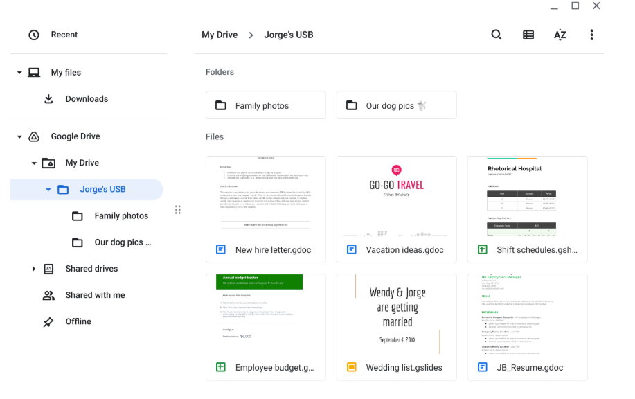

# Parking Lot USB Exercise — Attack Vectors Analysis

> **Document type:** Attacker mindset and risk analysis exercise  
> **Context:** Google Cybersecurity Certificate — Assets, Threats and Vulnerabilities module  
> **Skills demonstrated:** USB baiting attack recognition, PII identification, attacker mindset application, technical/operational/managerial control recommendations

---

## Scenario

A USB stick bearing the Rhetorical Hospital logo is found in the parking lot. Using virtualization software — which runs an isolated, sandboxed instance of the operating system disconnected from the network and other files — the drive is safely examined. Its contents belong to Jorge Bailey, the hospital's Human Resources manager.

---

## Analysis

### Contents

The drive contains files with PII — a resume, wedding plans, and family photos — alongside sensitive work documents such as a new hire letter, employee shift schedules, and a budget spreadsheet. Mixing personal and work files on the same unencrypted device is unsafe: a single point of compromise exposes both the individual and the organization simultaneously.

---

### Attacker Mindset

The work files could be used to impersonate Jorge in HR communications, target other employees listed in the shift schedule, or gain insight into the hospital's internal operations. Personal files such as the wedding list and family photos provide enough context to craft highly convincing phishing messages against Jorge's relatives. Together, this information could serve as the foundation for gaining unauthorized physical or logical access to the hospital.

---

### Risk Analysis

A device like this could conceal malware such as keyloggers, ransomware, or remote access trojans (RATs); if another employee had plugged it into a live workstation, the infection could have spread across the hospital network. Beyond malware, a threat actor finding this drive would gain access to PII, internal HR data, employee schedules, and financial information. That information could be used to impersonate staff, manipulate employees through social engineering, or plan a targeted physical intrusion. Technical controls such as disabling USB ports and endpoint DLP, combined with a policy requiring IT-issued encrypted drives and employee training to report found devices, would significantly reduce this risk.

---

## Key Concepts

### USB Baiting

A social engineering technique where an attacker deliberately leaves a USB drive in a location — such as a parking lot — hoping a curious employee will pick it up and connect it to a workstation. The drive may carry malware (keyloggers, ransomware, RATs) or simply contain sensitive data that was stolen in advance and placed there as a distraction while the real payload executes.

### Why Virtualization Matters

Plugging an unknown USB into a live machine risks infecting the host and spreading malware across the network. A **virtualized sandbox** isolates the session: if the drive contains malicious code, it can only affect the contained virtual instance, not the underlying system or any connected infrastructure.

### Types of Sensitive Data Found

| File | Data type | Risk |
|---|---|---|
| JB_Resume.gdoc | PII — full name, contact info, work history | Identity theft, spear phishing |
| Wedding list.gslides | PII — personal relationships | Targeted social engineering |
| New hire letter.gdoc | Internal HR data | Impersonation of HR staff |
| Shift schedules.gsheet | Operational data — employee names and schedules | Physical or logical access planning |
| Employee budget.gsheet | Financial data | Insider threat intel, fraud |
| Family photos / Dog pics | Personal imagery | Pretexting, trust-building attacks |

### Control Categories

| Type | Example controls |
|---|---|
| Technical | Disable USB ports, endpoint DLP, device whitelisting |
| Operational | Employee training, incident reporting procedures |
| Managerial | Removable media policy, IT-issued encrypted drives, asset inventory |

---

*Document created as part of a professional cybersecurity portfolio.*
